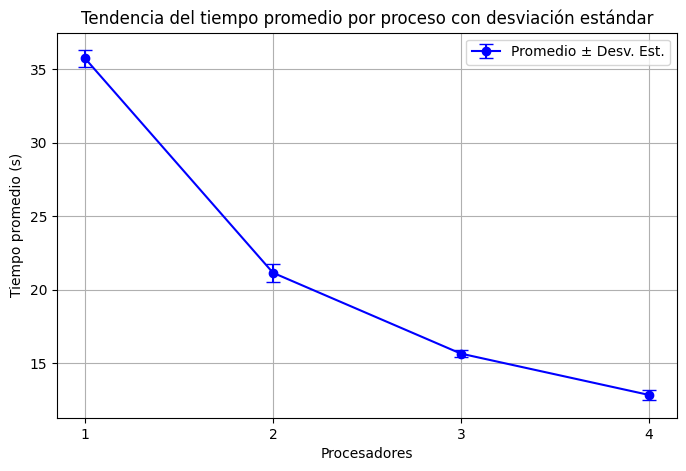
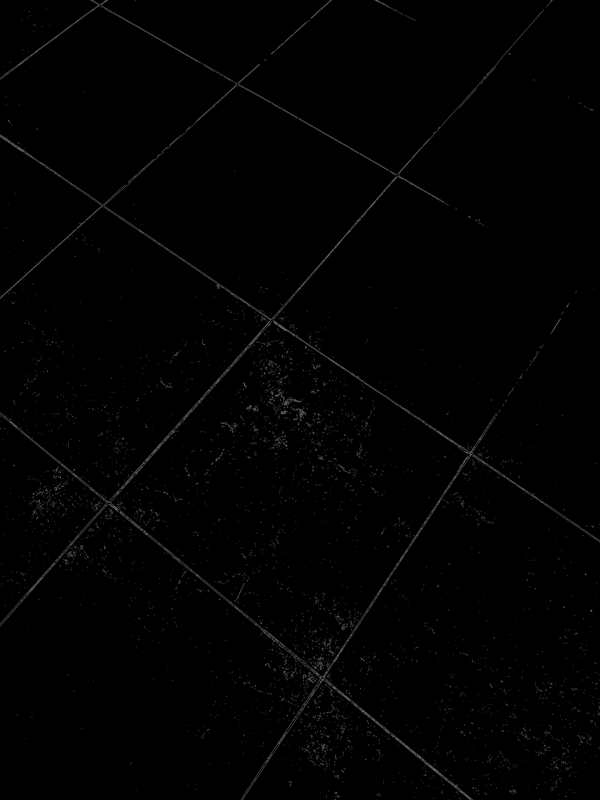
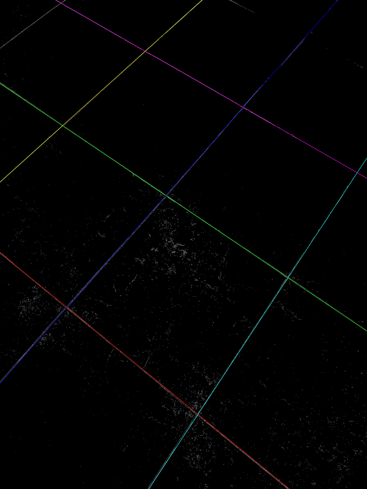

# Transformada de Hough en Paralelo


Este proyecto implementa la **Transformada de Hough** para detección de líneas en imágenes, utilizando **MPI** (Message Passing Interface) para paralelizar el cómputo en un clúster de múltiples nodos.  
El código está escrito en C++ con las bibliotecas **OpenCV** (para manejo de imágenes) y **MPI** (para comunicación entre procesos).

-----------

## Introducción 

La Transformada de Hough es una técnica ampliamente utilizada en visión por computadora para la detección de líneas rectas a partir de imágenes binarias, generalmente obtenidas mediante algoritmos de detección de bordes como Canny.

El método transforma cada píxel de borde de la imagen hacia un espacio paramétrico definido por $(ρ, θ)$, donde, $ρ$ representa la distancia del origen a la línea considerando una trayectoría perpendicular a la línea y $θ$ representa el ángulo de ese trayectoría con respecto al eje x. Cada combinación representa una posible línea recta. 

Para ello, el algoritmo evalúa todos los posibles ángulos $θ$ y calcula el valor correspondiente de $ρ = x·cosθ + y·sinθ$, registrando un “voto” en la posición $(ρ, θ)$ en una matriz bidimensional conocida como acumulador. Cuando se procesan dos puntos, hay una posición del acumulador que registra dos votos, indicando que los parámetros correspondientes a esa posición corresponde a la recta que une los puntos.

Cuando múltiples píxeles coinciden a lo largo de una misma recta se genera una alta concentración de votos en una posición del acumulador. De esta manera, detectar las rectas presentes en la imagen se reduce a encontrar las posiciones del acumulador con votos más altos.


-----------

## Complejidad computacional

Para una imagen que tiene $D$ pixeles en su diagonal, $n$ pixeles de bordes y $w$ posibles valores del ángulo $θ$, la complejidad es $ **O(n w)** $.

- En imágenes reales (por ejemplo, de 28 MP puede haber miles de pixeles de bordes), este proceso puede tomar varios segundos o incluso minutos en un solo procesador.
- El acumulador puede ser enorme (por ejemplo, $D × w$ celdas), lo que exige mucha memoria.

Para reducir el tiempo requerido, **es conveniente paralelizar la ejecución en múltiples procesadores** para obtener resultados en tiempos razonables.


-------------

## Paralelización 

1. **El proceso maestro (rank 0)** lee la imagen de bordes binarizada, extrae los puntos de bordes y los distribuye equitativamente entre todos los procesos.

2. **Cada proceso** recibe una lista de puntos y para cada punto (x,y), recorre los ángulos $θ$, calcula $ρ=xcos(θ)+ysin(θ)$ e incrementa el bin correspondiente del acumulador $(ρ, θ)$.

3. **Reducción global** MPI suma todos los acumuladores parciales en un acumulador global único (en el maestro). 

4. **El maestro** conserva únicamente los máximos locales y dibuja las líneas encontradas.


---------------

## Optimizaciones adicionales

- Se utiliza **`uint16_t`** (entero sin signo de 2 bytes) para almacenar el acumulador en lugar de `int` (4 bytes), reduciendo a la mitad la memoria necesaria y el tráfico de comunicaciones. También las posiciones (x,y) de cada punto se maneja como uint16_t para reducir el tiempo de envío de la lista de puntos. 

- El código verifica desbordamiento (máximo 65535 votos), suficiente para imágenes moderadas.

-------------------


## Resultados 

La gráfica muestra el tiempo promedio de ejecución ± desviación estándar al variar el número de procesadores MPI (1, 2, 3, 4) en un clúster de 4 nodos. Se observa una disminución clara del tiempo promedio de ejecución conforme aumenta el número de procesadores. Los datos graficados consideran los resultados de ejecutar el código 10 veces en cada ocasión.



- Con 1 procesador, el tiempo promedio es cercano a 36 s.
- Al pasar a 2 procesadores, el tiempo cae hasta aproximadamente 21 s.
- Con 3 y 4 procesadores, el tiempo sigue disminuyendo, aunque más gradualmente, llegando a cerca de 13 s con 4 procesadores.


-------------------

## Requisitos
- OpenCV instalado en todos los nodos del clúster.
- MPI (Intel MPI o MPICH) instalado y configurado con **acceso SSH sin contraseña** entre nodos.
- Compilador compatible con C++11 o superior.

------------------

## Ejecución

El programa acepta un argumento de entrada:

1. **Imagen de entrada** (binaria de bordes). En este caso`images/bordes_binarios.jpg`.


### Compilación

En el nodo maestro:

```bash
mpicxx -O0 -o hough_mpi hough_mpi.cpp `pkg-config --cflags --libs opencv4` -lm
```

### Ejecución en un nodo 

```bash
export I_MPI_SHM=0
```

```bash
time mpiexec -n 1 -f ../machinefile  ./hough_mpi ./images/bordes_binarios.jpg 
```

### Ejecución en cluster 

```bash
time mpiexec -n 4 -f ../machinefile  ./hough_mpi ./images/bordes_binarios.jpg 
```

------------

## Salida del programa 

El programa generará dos archivos:

- lineas_finales_hough_paralelo.jpg – imagen con las líneas detectadas.

- resultados_hough_paralelo.txt – estadísticas del acumulador y lista de líneas.


---------------

## Ejemplo de ejecución 

<h3>Imagen binaria de bordes (entrada)</h3>


<h3>Imagen procesada con las líneas detectadas</h3>



